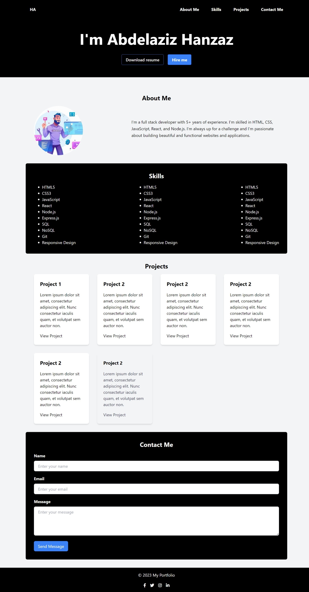

# My Portfolio

Welcome to My Portfolio! This project showcases my skills, projects, and provides a way to contact me. It is built using HTML, CSS (Tailwind CSS), and JavaScript.



## Features

- Hero section with download resume and hire me buttons.
- Navigation menu with smooth scrolling to different sections.
- About Me section with profile picture and description.
- Skills section displaying a list of skills.
- Projects section showcasing project cards.
- Contact Me section with a contact form.
- Footer with social network links.

## Usage

1. Clone the repository:

```bash
git clone https://github.com/your-username/your-portfolio.git
